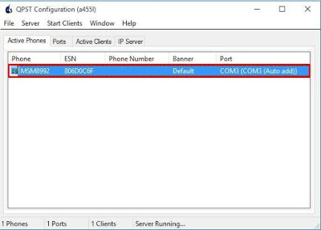
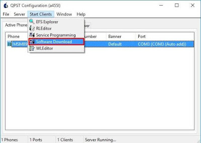
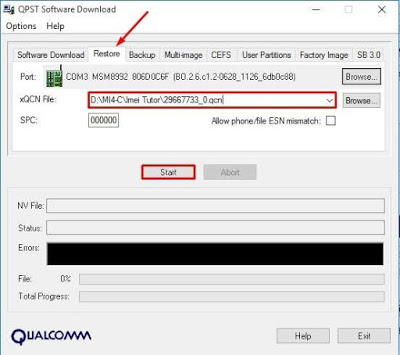

# Xiaomi Mi4c IMEI recovery

The International Mobile Equipment Identity or IMEI is a number, usually unique, to identify 3GPP (i.e., GSM, UMTS and LTE) and iDEN mobile phones, as well as some satellite phones. It is usually found printed inside the battery compartment of the phone, but can also be displayed on-screen on most phones by entering \*#06# on the dialpad, or alongside other system information in the settings menu on smartphone operating systems.

The IMEI number is used by a GSM network to identify valid devices and therefore can be used for stopping a stolen phone from accessing that network. For example, if a mobile phone is stolen, the owner can call their network provider and instruct them to "blacklist" the phone using its IMEI number. This renders the phone useless on that network and sometimes other networks too, whether or not the phone's SIM is changed.

The IMEI is only used for identifying the device and has no permanent or semi-permanent relation to the subscriber. Instead, the subscriber is identified by transmission of an IMSI number, which is stored on a SIM card that can (in theory) be transferred to any handset. However, many network and security features are enabled by knowing the current device being used by a subscriber.
\- [Wikipedia](https://en.wikipedia.org/wiki/International_Mobile_Equipment_Identity)

Because a phones IMEI is used to indentify the device it belongs to, a phone without an IMEI cannot connect to any cellular networks. Sadly, there are a multitude of ways to unfortunately delete the IMEI stored in the EFS of the Xiaomi Mi4c. This is a guide for how to restore the IMEI on a Xiaomi Mi4c.

## Backup files
Normal disclaimer applies. Backup your files whenever you work on any device.

## Download files
I've attached a few files:
1. **mi4c.qcn**: an IMEI backup from another phone
2. **QPST**: the program for uploading the IMEI backup
3. **IMEI converter** converts IMEI to hex

The IMEI converter is optional, but useful.

## Root phone and enable USB debugging
Other people have already written this part up, and in the spirit of refactoring, I will link to them rather than repeating what they say.
 - [Unlocking the Mi4c Bootloader without verification by Xiaomi](unlocking)
 - [Root and install twrp recovery on Xiaomi mi4c](twrp-root)
 - [SuperSu install](supersu)
 - [Enable USB debugging](usb-debugging)

## Setup other software
- [Here's a guide for how to install ADB and Fastboot.](adb-fastboot)
- You'll need a hex editor. [Here's one](hexeditor), but there are many to choose from.

## Enable diagnostics mode
Open up your command prompt and run
```
adb shell
su
setprop sys.usb.config diag
```
This enables the diagnostics mode on your phone, priming it for QPST

## Check drivers
Go to "Device Manager" and check if your drivers are installed correctly. If they are not, try [enabling unsigned drivers](unsigned-drivers) and reinstalling/updating the drivers for the phone.

## Edit mi4c.qcn
Open up your hex editor and search for "08 5A 44 13 66 06 75 76 36"
Change this to your IMEI that you converted into hex with the IMEI converter attached.

## Erase existing IMEI files
```
adb shell
su

dd if=/dev/block/mmcblk0p28 of=/sdcard/modemst1
dd if=/dev/block/mmcblk0p29 of=/sdcard/modemst2
dd if=/dev/block/mmcblk0p33 of=/sdcard/fsg

dd if=/dev/zero of=/dev/block/mmcblk0p28
dd if=/dev/zero of=/dev/block/mmcblk0p29
dd if=/dev/zero of=/dev/block/mmcblk0p33

reboot
```
This clears the way for the new files.

## Repeat [Enable diagnostics mode](#enable-diagnostics-mode)

## Use QPST to update EFS
Install and run QPST. It should automatically detect your phone.



Click the "Start Clients" tab, then select Software Download



Select your modified qcn file and click start. It may reach 100% quickly, but it will still be working until the exit button is not greyed out.



## Reboot phone

# Celebrate! (Or retry if not successful)

### Credit to http://www.miuitutorial.com/2016/10/imei-xiaomi-mi4c-kamu-hilang-jangan.html and Defforest@enMiuiForum


[unsigned-drivers]:(http://www.howtogeek.com/167723/how-to-disable-driver-signature-verification-on-64-bit-windows-8.1-so-that-you-can-install-unsigned-drivers/)
[usb-debugging]:(http://www.phonearena.com/news/How-to-enable-USB-debugging-on-Android_id53909)
[hexeditor]:(https://mh-nexus.de/en/hxd/)
[adb-fastboot]:(http://lifehacker.com/the-easiest-way-to-install-androids-adb-and-fastboot-to-1586992378)
[twrp-root]:(http://www.stechguide.com/root-and-install-twrp-recovery-on-xiaomi-mi4c/)
[supersu]:(https://forum.xda-developers.com/apps/supersu/stable-2016-09-01supersu-v2-78-release-t3452703)
[unlocking]:(https://forum.xda-developers.com/mi-4c/general/guide-unlocking-mi4c-bl-verification-t3336779)
